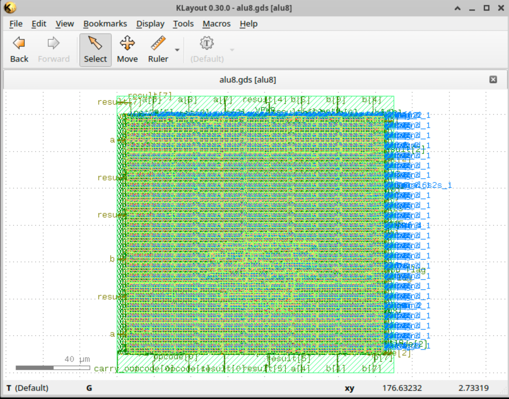

# 8-bit ALU — RTL to GDSII (Open-Source Flow)

An 8-bit Arithmetic Logic Unit designed in Verilog and taken through a complete RTL-to-GDSII physical design flow using open-source EDA tools.

## Overview

The ALU supports 8 operations selected via a 3-bit opcode: ADD, SUB, AND, OR, XOR, NOT, SHL, SHR — with carry-out and zero-flag outputs. The design was functionally verified through simulation, then synthesized and physically implemented into a manufacturable layout (GDSII) using the OpenLane flow with the SkyWater 130nm (sky130) open-source PDK.

## Tools Used

- **RTL Design & Simulation:** Verilog, Icarus Verilog (iverilog)
- **Synthesis:** Yosys
- **Physical Design (Floorplan, Placement, CTS, Routing):** OpenROAD, via OpenLane
- **Signoff (DRC/LVS/STA):** Magic, Netgen, OpenSTA
- **Layout Viewing:** KLayout
- **PDK:** SkyWater sky130A (open-source)

## Flow Stages Completed

RTL → Synthesis → Floorplanning → Placement → Clock Tree Synthesis → Routing → Signoff (DRC/LVS/STA) → GDSII

All stages completed with **zero routing violations and zero DRC/LVS errors** on first run.

## Results

| Metric | Value |
|---|---|
| Flow status | Completed |
| Total runtime | ~1 min 24 sec |
| Die area | 0.0225 mm² |
| Standard cell count | 269 |
| Wire length | ~4.6 mm |
| Critical path | 2.91 ns |
| Max achievable clock frequency | ~100 MHz |
| Routing violations | 0 |
| DRC / LVS errors | 0 |

## Layout



## Repository Structure
alu8-openlane/
├── src/
│   ├── alu8.v          # ALU RTL design
│   └── alu8_tb.v        # Testbench
├── results/
│   ├── alu8.gds              # Final GDSII layout
│   ├── layout_screenshot.png # KLayout view of final chip
│   └── synthesis_report.txt  # Synthesis stats
├── config.json          # OpenLane configuration
└── README.md

## Running It Yourself

```bash
# Simulate first
iverilog -o alu8_sim src/alu8.v src/alu8_tb.v
vvp alu8_sim

# Run through OpenLane (from OpenLane root, with this design folder placed under designs/)
./flow.tcl -design alu8 -tag run1
```

## Notes

This is a combinational ALU (no clock-dependent logic), so CTS and clock-related timing constraints had minimal impact on the flow. All operations were validated against expected outputs via testbench simulation before running the physical design flow.
